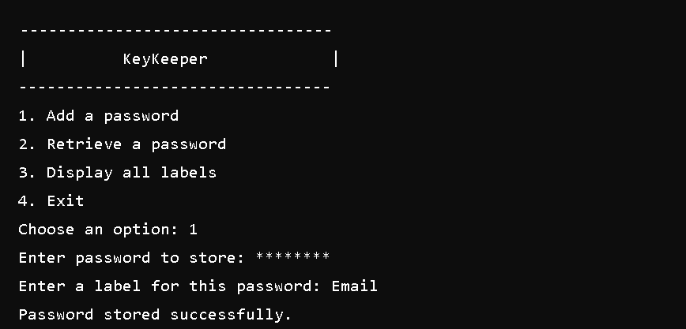

# KeyKeeper
KeyKeeper is a command-line password manager with AES-256 encryption. Safely store and retrieve passwords by labels. Easy setup, robust security.

## Features

- **Add Passwords:** Securely store passwords with a label.
- **Retrieve Passwords:** Retrieve passwords by their label.
- **Display Labels:** View all stored labels without revealing passwords.
- **Encryption:** Uses AES-256 encryption for securing passwords.

## Pre-requisites

- **OpenSSL:** Ensure you have OpenSSL installed on your system. You can install it using the following commands:

  - On Debian-based systems (Ubuntu, etc.):
    ```bash
    sudo apt-get install openssl
    ```

  - On Red Hat-based systems (Fedora, CentOS, etc.):
    ```bash
    sudo yum install openssl
    ```

  - On macOS:
    ```bash
    brew install openssl
    ```

## Installation

1. **Clone the Repository:**

    ```bash
    git clone https://github.com/vinaypatil-132/KeyKeeper.git
    ```

2. **Navigate to the Directory:**

    ```bash
    cd KeyKeeper
    ```

3. **Make the Script Executable:**

    ```bash
    chmod +x keykeeper.sh
    ```

## Usage

### Running the Script

To start the key keeper Tool, run the following command:

```bash
./keykeeper.sh
```

## Example Session



Here is an example session demonstrating the usage of KeyKeeper for adding, retrieving, and managing passwords securely.
